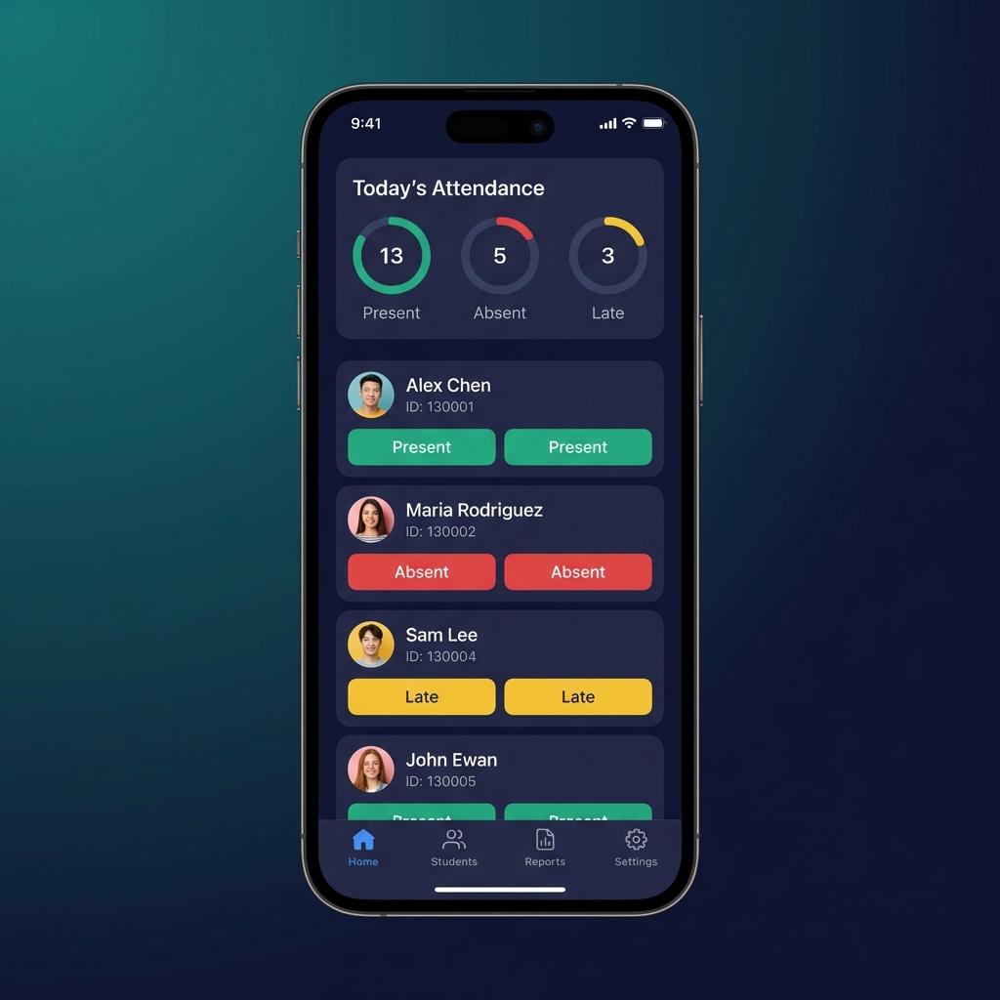

# 🎓 EduTrack - Smart Attendance Tracking System

A modern, full-featured attendance management system built for educational institutions with role-based dashboards, real-time analytics, offline support, and glassmorphism UI design.



## ✨ Features

### 🔐 Role-Based Access Control
- **Admin Dashboard**: Complete system control with user management, analytics, and configuration
- **Teacher Dashboard**: Class management, attendance marking, student monitoring, and report generation
- **Student Dashboard**: View attendance records, submit leave requests, and track academic performance

### 📊 Core Functionality
- **Real-Time Attendance Tracking**: Mark and monitor attendance instantly with live updates
- **Smart Analytics**: Comprehensive reports with predictive insights to identify at-risk students
- **Automated Notifications**: Instant alerts for low attendance, absences, and important updates
- **Class Management**: Effortlessly manage classes, subjects, schedules, and student rosters
- **Leave Request System**: Students can submit leave requests; teachers/admins can approve/reject
- **Calendar Integration**: Event management with schedule tracking and notifications
- **Audit Logging**: Complete attendance history with modification tracking

### 🎨 Modern UI/UX
- **Glassmorphism Design**: Beautiful frosted glass effects on home and login pages
- **Dark/Light Theme**: Seamless theme switching with persistent preferences
- **Responsive Design**: Optimized for desktop, tablet, and mobile devices
- **Animated Components**: Smooth transitions and engaging micro-interactions

### 📱 Progressive Web App (PWA)
- **Offline Support**: Work without internet connection using IndexedDB persistence
- **Auto-Sync**: Automatically syncs offline data when connection is restored
- **Installable**: Add to home screen on mobile devices
- **Service Worker**: Caching strategies for optimal performance

### 🔧 Technical Features
- **Firebase Integration**: Real-time database with Firestore
- **Offline Persistence**: IndexedDB for local data storage
- **Network Sync**: Automatic synchronization of offline attendance records
- **Secure Authentication**: Firebase Auth with role-based access
- **PDF Export**: Generate attendance reports in PDF format
- **Excel Export**: Export data to Excel spreadsheets
- **Performance Monitoring**: Built-in performance tracking

## 🚀 Tech Stack

### Frontend
- **React 18.3** - Modern UI library
- **TypeScript** - Type-safe development
- **Vite** - Lightning-fast build tool
- **React Router v6** - Client-side routing
- **TanStack Query** - Server state management

### UI Components
- **Radix UI** - Accessible component primitives
- **Tailwind CSS** - Utility-first styling
- **shadcn/ui** - Beautiful component library
- **Lucide React** - Icon library
- **Recharts** - Data visualization

### Backend & Database
- **Firebase** - Backend as a Service
  - Firestore - NoSQL database
  - Firebase Auth - Authentication
  - Firebase Analytics - Usage tracking
- **IndexedDB** - Client-side storage for offline support

### Additional Libraries
- **React Hook Form** - Form management
- **Zod** - Schema validation
- **date-fns** - Date manipulation
- **jsPDF** - PDF generation
- **XLSX** - Excel file handling
- **Sonner** - Toast notifications

## 📦 Installation

### Prerequisites
- Node.js 18+ and npm/yarn
- Firebase account with project setup

### Setup Steps

1. **Clone the repository**
```bash
git clone <repository-url>
cd attendance-tracker
```

2. **Install dependencies**
```bash
npm install
```

3. **Configure Firebase**
   - Create a Firebase project at [Firebase Console](https://console.firebase.google.com)
   - Enable Firestore Database
   - Enable Authentication (Email/Password)
   - Copy your Firebase config to `src/lib/firebase.ts`

4. **Environment Variables**
   - Update `.env` file with your configuration (if using Supabase for additional features)

5. **Run development server**
```bash
npm run dev
```

6. **Build for production**
```bash
npm run build
```

## 🗂️ Project Structure

```
attendance-tracker/
├── public/
│   ├── manifest.json          # PWA manifest
│   ├── service-worker.js      # Service worker for offline support
│   └── screenshot-1.png       # App screenshot
├── src/
│   ├── components/
│   │   ├── admin/             # Admin-specific components
│   │   ├── attendance/        # Attendance tracking components
│   │   ├── auth/              # Authentication components
│   │   ├── layout/            # Layout components
│   │   └── ui/                # Reusable UI components (50+ components)
│   ├── contexts/
│   │   ├── AuthContext.tsx    # Authentication state management
│   │   └── ThemeContext.tsx   # Theme management (dark/light)
│   ├── hooks/
│   │   ├── useNetworkSync.ts  # Offline sync hook
│   │   └── useReportGenerator.ts # Report generation hook
│   ├── lib/
│   │   ├── firebase.ts        # Firebase configuration
│   │   ├── adminUtils.ts      # Admin utility functions
│   │   ├── attendanceUtils.ts # Attendance logic
│   │   ├── authUtils.ts       # Authentication utilities
│   │   ├── classUtils.ts      # Class management
│   │   ├── enrollmentUtils.ts # Student enrollment
│   │   ├── eventUtils.ts      # Calendar events
│   │   ├── leaveUtils.ts      # Leave request handling
│   │   ├── offlineStorage.ts  # IndexedDB operations
│   │   └── userUtils.ts       # User management
│   ├── pages/
│   │   ├── admin/             # Admin dashboard pages
│   │   ├── teacher/           # Teacher dashboard pages
│   │   ├── student/           # Student dashboard pages
│   │   ├── Index.tsx          # Landing page (glassmorphism)
│   │   └── Auth.tsx           # Login page (glassmorphism)
│   ├── App.tsx                # Main app component
│   ├── main.tsx               # Entry point
│   └── index.css              # Global styles
├── package.json
├── vite.config.ts
├── tailwind.config.ts
└── tsconfig.json
```

## 👥 User Roles & Permissions

### Administrator
- Full system access and control
- User management (create, edit, delete users)
- Class and subject management
- System-wide attendance monitoring
- Advanced analytics and reports
- Calendar event management
- System utilities and maintenance
- Password reset and role assignment

### Teacher
- Manage assigned classes
- Mark student attendance
- View and monitor student performance
- Generate class reports
- Approve/reject leave requests
- View class schedules
- Access student profiles

### Student
- View personal attendance records
- Submit leave requests
- Track attendance percentage
- View class schedules
- Receive notifications
- Access performance insights

## 🔑 Default Credentials

After initial setup, you'll need to create users through Firebase Console or use the admin panel:

**Admin Account** (Create manually in Firebase):
- Email: admin@institution.edu
- Password: (set during creation)
- Role: admin

## 📱 PWA Features

### Offline Capabilities
- View cached attendance data
- Mark attendance offline (syncs when online)
- Access student information
- View schedules and reports

### Installation
- Click "Install EduTrack App" button on login page
- Or use browser's "Add to Home Screen" option
- Works on iOS, Android, and Desktop

## 🎨 Theme System

The application supports two themes:
- **Light Theme**: Clean, professional appearance
- **Dark Theme**: Reduced eye strain with elegant dark UI

Theme preference is saved locally and persists across sessions.

## 📊 Database Schema

### Collections

#### users
```typescript
{
  id: string;
  userId: string;        // Auto-generated (ADM001, TCH001, STD001)
  email: string;
  name: string;
  role: 'admin' | 'teacher' | 'student';
  phone?: string;
  address?: string;
  dateOfBirth?: string;
  gender?: string;
  department?: string;
  semester?: number;
  enrollmentYear?: number;
  guardianName?: string;
  guardianPhone?: string;
  forcePasswordChange?: boolean;
  createdAt: Timestamp;
  updatedAt: Timestamp;
}
```

#### classes
```typescript
{
  id: string;
  name: string;
  subject: string;
  teacherId: string;
  teacherName: string;
  schedule: string;
  semester: number;
  department: string;
  academicYear: string;
  studentCount: number;
  createdAt: Timestamp;
  updatedAt: Timestamp;
}
```

#### attendance
```typescript
{
  id: string;
  classId: string;
  studentId: string;
  date: string;
  status: 'present' | 'absent' | 'late' | 'excused';
  markedBy: string;
  markedAt: Timestamp;
  notes?: string;
  sessionId?: string;
}
```

#### leaveRequests
```typescript
{
  id: string;
  studentId: string;
  studentName: string;
  startDate: string;
  endDate: string;
  reason: string;
  status: 'pending' | 'approved' | 'rejected';
  reviewedBy?: string;
  reviewedAt?: Timestamp;
  submittedAt: Timestamp;
}
```

#### events
```typescript
{
  id: string;
  title: string;
  description: string;
  date: string;
  type: 'holiday' | 'exam' | 'event' | 'meeting';
  createdBy: string;
  createdAt: Timestamp;
}
```

## 🔧 Configuration

### Firebase Setup
1. Update `src/lib/firebase.ts` with your Firebase config
2. Enable Firestore Database
3. Enable Authentication (Email/Password provider)
4. Set up Firestore security rules

### Firestore Security Rules Example
```javascript
rules_version = '2';
service cloud.firestore {
  match /databases/{database}/documents {
    match /users/{userId} {
      allow read: if request.auth != null;
      allow write: if request.auth != null && 
        (request.auth.uid == userId || 
         get(/databases/$(database)/documents/users/$(request.auth.uid)).data.role == 'admin');
    }
    
    match /classes/{classId} {
      allow read: if request.auth != null;
      allow write: if request.auth != null && 
        get(/databases/$(database)/documents/users/$(request.auth.uid)).data.role in ['admin', 'teacher'];
    }
    
    match /attendance/{attendanceId} {
      allow read: if request.auth != null;
      allow write: if request.auth != null && 
        get(/databases/$(database)/documents/users/$(request.auth.uid)).data.role in ['admin', 'teacher'];
    }
  }
}
```

## 🚀 Deployment

### Build for Production
```bash
npm run build
```

### Deploy to Firebase Hosting
```bash
npm install -g firebase-tools
firebase login
firebase init hosting
firebase deploy
```

### Deploy to Vercel
```bash
npm install -g vercel
vercel
```

### Deploy to Netlify
```bash
npm install -g netlify-cli
netlify deploy --prod
```

## 🧪 Development

### Available Scripts
- `npm run dev` - Start development server
- `npm run build` - Build for production
- `npm run build:dev` - Build in development mode
- `npm run lint` - Run ESLint
- `npm run preview` - Preview production build

### Code Style
- TypeScript for type safety
- ESLint for code quality
- Prettier for code formatting
- Tailwind CSS for styling

## 📈 Performance Optimizations

- **Code Splitting**: Lazy loading of routes and components
- **Image Optimization**: Optimized assets and lazy loading
- **Caching Strategy**: Service worker with cache-first approach
- **Bundle Size**: Tree-shaking and minification
- **Database Queries**: Optimized Firestore queries with indexing
- **Offline First**: IndexedDB for local data persistence

## 🔒 Security Features

- Firebase Authentication with secure token management
- Role-based access control (RBAC)
- Firestore security rules
- Password strength requirements
- Force password change on first login
- Audit logging for attendance modifications
- XSS protection
- CSRF protection

## 🐛 Known Issues & Limitations

- Multiple tabs may cause persistence conflicts (Firestore limitation)
- Service worker requires HTTPS in production
- Large datasets may require pagination optimization
- PDF export has file size limitations

## 🤝 Contributing

Contributions are welcome! Please follow these steps:

1. Fork the repository
2. Create a feature branch (`git checkout -b feature/AmazingFeature`)
3. Commit your changes (`git commit -m 'Add some AmazingFeature'`)
4. Push to the branch (`git push origin feature/AmazingFeature`)
5. Open a Pull Request

## 📄 License

This project is licensed under the MIT License - see the LICENSE file for details.

## 👨‍💻 Author

Built with ❤️ for modern educational institutions

## 🙏 Acknowledgments

- [shadcn/ui](https://ui.shadcn.com/) for beautiful components
- [Radix UI](https://www.radix-ui.com/) for accessible primitives
- [Lucide](https://lucide.dev/) for icons
- [Firebase](https://firebase.google.com/) for backend services
- [Vite](https://vitejs.dev/) for blazing fast builds

## 📞 Support

For support, email support@edutrack.com or open an issue in the repository.

---

**Made with React, TypeScript, and Firebase** 🚀
